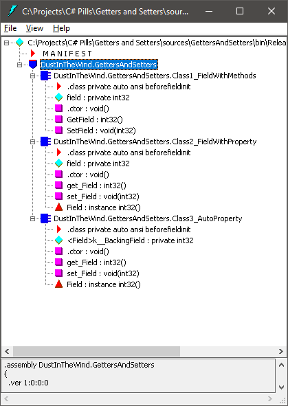

# Getters and Setters

## Problem Description

**Do you question the reality?**

Did you ask yourself what is a property in C#? Maybe not. What reason would you have to do that? A property is a property. Just like a field is a field, a method is a method and so on. They are basic elements that we use to create our programs. Right?

**Properties**

But, what if a property is not so basic? What if it is just a syntactic sugar for easier writing two special methods: the getter and the setter for a field?

**Question**

This C# Pill is trying to answer this question:

- Is a property in C# just a collection of two methods?

## Setup

As we know, classes can contain data (as fields) and methods that act on that data.

Let's start by creating a simple field in a class:

```csharp
internal class Class1
{
    public int field = 5;
}
```

### Get and Set Methods

Over the time, programmers decided that it would be a good idea to have a way to control the access to that data. So, the programmers decided to make it private and provide two public methods called setter and getter for accessing the data:

```csharp
internal class Class1_FieldWithMethods
{
    private int field = 5;
    
    public int GetField()
    {
        return field;
    }

    public void SetField(int value)
    {
        field = value;
    }
}
```

This approach has the advantage that the class may perform additional actions whenever the field is read or updated.

This pattern is used in Java.

**Note**: An even better idea is to avoid exposing the data at all. Instead, expose functionality in the form of methods. But this is another topic.

### The Property

When C# appeared, it decided to provide a custom syntax for writing those two methods.

```csharp
internal class Class2_FieldWithProperty
{
    private int field = 5;

    public int Field
    {
        get
        {
            return field;
        }
        set
        {
            field = value;
        }
    }
}
```

This structure was called a Property.

**Advantages:**

- The two get-set methods are spatially grouped together in the code. Cannot be separated by other members.
- The signature of the two methods is fixed by the compiler so it is not necessary to explicitly write it. A simple `get` and `set` keywords are sufficient.
- The property can be used just like a field. The syntax is cleaner.
- Being implemented as a pair of methods, the property can be added in interfaces.

### The Auto-Property

Over the time, the programmers observed that more often then not, the programmers use trivial properties, that does not provide additional code in the getters and setters beside exposing the field. So, C# provided a cleaner syntax for such a trivial property:

```csharp
internal class Class3_AutoProperty
{
    public int Field { get; set; } = 5;
}
```

**Note**: The previous syntax is still available for the situations when additional actions are needed on the setter and getter, but when there is not such need, the auto-property is more cleaner and easier to write.

## Question

But now we have this question:

- Does a property actually create those two methods behind the scene or it does some other tricks there?

Let's compile in release mode the previous class and look at it with ILDASM.

### Decompile with ILDASM

When decompiled, we can see that, for the properties in `Class2_FieldWithProperty` and `Class3_AutoProperty`, two methods are created:

- `get_Field: int32()`
- `set_Field: void(int32)`



### Manually create the methods

If we try to manually create those two methods while we also have the property, we receive a compilation error.

**Methods**

```csharp
internal class Class3_AutoProperty
{
    public int Field { get; set; } = 5;

    public int get_Field()
    {
        return 0;
    }

    public void set_Field(int value)
    {
    }
}
```

**Compilation error**


## Did you know?

### Object Initializer

Many times we need to initialize some properties right after we create the instance. For example, having a `Person` class:

```csharp
internal class Person
{
    public string Name { get; set; }
    public int Age { get; set; }
}
```

We may need to initialize it like this:

```csharp
Person person = new Person();
person.Name = "Alexandru";
person.Age = 41;
```

C# provides a custom syntax for writing such object initializations:

```csharp
Person person = new Person
{
    Name = "Alexandru",
	Age = 41
}
```

#### Advantages

- Cleaner and more expressive initialization block.

#### Disadvantages

- I didn't found yet.

### Object Initializer vs Read-only properties

Unfortunately, when we need the properties to be read-only, we have to use the old way, and provide the values through a constructor:

```csharp
internal class Person
{
    public string FirstName { get; }
    public int Age { get; set; }
    
    public Person(string firstName, int age)
    {
        FirstName = firstName;
		Age = age;
    }
}
```

Then call it like this:

```csharp
Person person = new Person("Alexandru", 41);
```

#### Advantages

- The properties are read-only.

#### Disadvantages

- **Many parameters in constructor (low readability)**
  - If there are many properties to be initialized, the constructor will have as many parameters.
- **Hard to remember parameter's order in constructor (low readability)**
  - When constructor has many parameter it is hard to remember the order in which they must be provided.
- **Harder to understand what each constructor argument represents (low readability)**
  - When constructor has many parameters it is harder to understand what represents each parameter without looking into the `Person`'s implementation. The best we can do is to guess what each argument represents based on their value. For example, that `41` may be the age or the height or the weight, etc. We have no way to know without going to the `Person`'s implementation.

But I think you are already familiar with these patterns. What you may not know is that, from C# 9.0, there is a new keyword: `init` that can be used instead of `set`. Read further...

### Init only setter

The `init` keyword helps when we want to create a read-only property that can be set only once, from an object initializer, removing the need for a constructor. Let's have the `Person` class again, this time with init-only properties.

```csharp
internal class Person
{
    public string FirstName { get; init; }
    public int Age { get; init; }
}
```

This code will compile just fine:

```csharp
Person person = new Person
{
    FirstName = "Alexandru",
    Age = 41
}
```

This code will not compile:

```csharp
Person person = new Person();
person.FirstName = "Alexandru";    // compile-time error
person.Age = 41;                   // compile-time error
```

#### Advantages of using init-only properties:

- Provides the same functionality (read-only properties) with less code needed to be written inside the class (no need to write a constructor).
- Also, the initialization is more easy to understand and provides more information, then using a constructor, because we explicitly provide the name of each property we initialize.

#### Disadvantages of using init-only properties:

- I didn't found yet.
